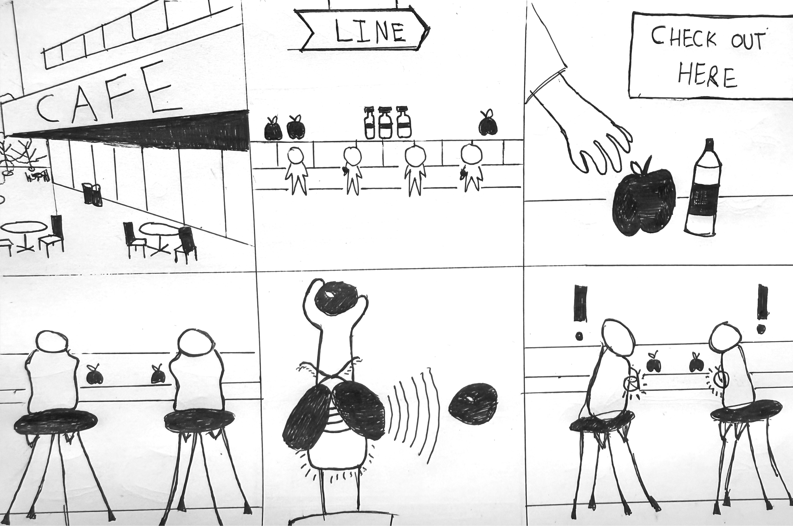

# Staging Interaction

\*\***Rajvi Ranjit Patil(rp674@cornell.edu)**\*\*

In the original stage production of Peter Pan, Tinker Bell was represented by a darting light created by a small handheld mirror off-stage, reflecting a little circle of light from a powerful lamp. Tinkerbell communicates her presence through this light to the other characters. See more info [here](https://en.wikipedia.org/wiki/Tinker_Bell). 

There is no actor that plays Tinkerbell--her existence in the play comes from the interactions that the other characters have with her.

For lab this week, we draw on this and other inspirations from theatre to stage interactions with a device where the main mode of display/output for the interactive device you are designing is lighting. You will plot the interaction with a storyboard, and use your computer and a smartphone to experiment with what the interactions will look and feel like. 

_Make sure you read all the instructions and understand the whole of the laboratory activity before starting!_

## Prep

### To start the semester, you will need:
1. Read about Git [here](https://git-scm.com/book/en/v2/Getting-Started-What-is-Git%3F).
2. Set up your own Github "Lab Hub" repository by forking the [Interactive-Lab-Hub repository](https://github.com/FAR-Lab/Interactive-Lab-Hub). To get lab updates, simply [use GitHub's "Sync fork" button when new content is available](https://docs.github.com/en/pull-requests/collaborating-with-pull-requests/working-with-forks/syncing-a-fork).

3. Set up the README.md for your Hub repository (for instance, so that it has your name and points to your own Lab 1). You can [learn how to organize and format your README.md here](https://docs.github.com/en/get-started/writing-on-github/getting-started-with-writing-and-formatting-on-github/basic-writing-and-formatting-syntax). Make sure to include links to your submissions so they are easy to find.

### For this lab, you will need:
1. Paper
2. Markers/ Pens
3. Scissors
4. Smart Phone -- The main required feature is that the phone needs to have a browser and display a webpage.
5. Computer -- We will use your computer to host a webpage which also features controls.
6. Found objects and materials -- You will have to costume your phone so that it looks like some other devices. These materials can include doll clothes, a paper lantern, a bottle, human clothes, a pillow case, etc. Be creative!

### Deliverables for this lab are: 
1. 7 Storyboards
1. 3 Sketches/photos of costumed devices
1. Any reflections you have on the process
1. Video sketch of 3 prototyped interactions
1. Submit the items above in the lab1 folder of your class [Github page], either as links or uploaded files. Each group member should post their own copy of the work to their own Lab Hub, even if some of the work is the same from each person in the group.

### The Report
This README.md page in your own repository should be edited to include the work you have done (the deliverables mentioned above). Following the format below, you can delete everything but the headers and the sections between the **stars**. Write the answers to the questions under the starred sentences. Include any material that explains what you did in this lab hub folder, and link it in your README.md for the lab.

## Lab Overview
For this assignment, you are going to:

A) [Plan](#part-a-plan) 

B) [Act out the interaction](#part-b-act-out-the-interaction) 

C) [Wizard the device](#part-c-wizard-the-device) 

D) [Costume the device](#part-d-costume-the-device)

E) [Prototype the device](#part-e-prototype-the-device)

F) [Record the interaction](#part-f-record)

Labs are due on Mondays. Make sure this page is linked to on your main class hub page.

## Part A. Plan 

\*\***Describe your setting, players, activity and goals here.**\*\*

_Overview:_ To create a pair of interactive devices that leads to spontaneous interaction between strangers, wanting to meet people who have similar hobbies, interests, language, or come from same background, etc. It uses light signal, that flashes the same color, indicating that there is a shared goal, background or characteristics between the users, making it easy for them to start a conversation.

_Setting:_ Social gatherings, activities that require people to step out of house.

_Players:_ The interaction takes place between 2 or more people, who have never met before, but are interested in making new friends, connections and networking.

_Activity:_ The players are engaged in shared activities, examples are players meeting during orientation, jogging on the same path, travelling, waiting for a bus(commute), concert, etc. The condition is for the players to be in vicinity of the other.

_Interaction:_  Players are wearing the device and have a choice to set the preference to matching criterion. If the criterion is fulfilled, and if the players are standing near each other, (let’s call this zone as connection making zone where people get matched, light being the indicator) in the connection making zone, their devices will flash same color lights indicating, a match, they can then find the person, by trying to spot the flashing light around them, further going ahead to connect with them.

\*\***Include pictures of your storyboards here**\*\*

## Storyboards

The following storyboards have been set for various scenarios such as users attending orientation, at a restrarant, travelling, at a bustop, jogging. Every time a match is made, the underlying proximity rule changes based on the user preference for matching, it can be hoobies, interestes, destination, activity, food item, etc:

<table align="center">
  <tr>
    <td></td>
    <td></td>
  </tr>
  <tr>
    <td></td>
    <td></td>
  </tr>
  <tr>
    <td></td>
    <td></td>
  </tr>
</table>

\*\***Summarize feedback you got here.**\*\*

_Reflection:_ This product acts on the assumption that people want to have a conversation or engage with people they have things in common with. This device uses proximity as a factor, what happens when you match with several people around you? Are the matches queued? Are the strongest matches notified before? We want a big enough screen/surface for light to be visible

_Feedback:_ Light is not the best way to grab the users attention in case of a match in the broad daylight( Vibrations? (how will it be different thatn the mobile notifications). Think about matching process beyond 2 people, how will you match a group of 4 people, what will be the maximum number of people matching? 3 people dynamics: If Person A like apples & cats, Person B likes orange & cats and person C likes Orange & Dogs, think about the interaction between 3 people.

## Part B. Act out the Interaction

\*\***Are there things that seemed better on paper than acted out?**\*\*

Having a similar eating habit seemed to be interesting on paper. Acting it out in the setting of the cafe, led to discussion about food items as things people can see and observe and do not require flashing of light(indicator) for people to have a conersation about them. Also there are selected number of food items and drins available so the matching frequency will be greater in this case.

\*\***Are there new ideas that occur to you or your collaborator that come up from the acting?**\*\*

- The user can have niche interests(Martial arts or stamp collection) that they can keep as preferences, the frequency of interactions based on such interests will be less. The question arises, what will be the role of proximity in these scenarios.
  
- Matching process based on the same interests/activities will be a conversation initiator. On the other hand, it wil be interesting to see, how the matching process wil work based on different interets that compliment each other. Will this lead to interesting conversations and exchange of knowledge?

## Part C. Wizard the device
Take a little time to set up the wizarding set-up that allows for someone to remotely control the device while someone acts with it. Hint: You can use Zoom to record videos, and you can pin someone’s video feed if that is the scene which you want to record. 

\*\***Include your first attempts at recording the set-up video here.**\*\*

_Wizard Setup Video:_ https://drive.google.com/file/d/1q0Dth6uk1UATWI9xTpk5bZQh2o29zhuR/view?usp=drive_link

\*\***Show the follow-up work here.**\*\*

## Part D. Costume the device

Only now should you start worrying about what the device should look like. Develop three costumes so that you can use your phone as this device.

Think about the setting of the device: is the environment a place where the device could overheat? Is water a danger? Does it need to have bright colors in an emergency setting?

\*\***Include sketches of what your devices might look like here.**\*\*

<table align="center">
  <tr>
    <td></td>
    <td>
       
      <small>Img 1 referenced below</small>
    </td>
  </tr>
  <tr>
    <td></td>
    <td></td>
  </tr>
</table>

_Img 1 generated by A.I, prompt: Create an image of a firefly inspired wearable device that glows and can be worn by people on their arm. The design should be minimalistic and apple-inspired. It will be worn around the bicep._

\*\***What concerns or opportunitities are influencing the way you've designed the device to look?**\*\*

The devices design is inspired from fireflies, bio-inspired design. The bioluminiscent effect overlaps with our design , where emitting light  is the medium of interaction.

## Part E. Prototype the device

Rapid Prototyping:

  
  
  
  

## Part F. Record

\*\***Take a video of your prototyped interaction.**\*\*

**Setting, players, activity and goals**
- _Setting:_ Road running
- _Players:_ Runners / Running Enthusiasts
- _Activity:_  Marathon Training / Hobby Running
- _Goals:_ To match runners training for the same marathon or following the same route
- _Video 1:_ https://drive.google.com/file/d/16K0l06t5nviMj4vyUiN827Lc9GmsSyCl/view?usp=drive_link 

- _Setting:_ The Cafe
- _Players:_ Cafe customers
- _Activity:_  Miscellaneous / Consuming cafe food
- _Goals:_ To match people having same food likings.
- _Video 2:_ https://drive.google.com/file/d/1WjtDVWhu4xlWhua-EuUwstQGYzlsXpuw/view?usp=drive_link

- _Setting:_ At the station
- _Players:_ Commuters
- _Activity:_ Waiting for the bus/tram/train/metro
- _Goals:_ To match people traveling to the same destination and are from the same organization.
- _Video 3:_ https://drive.google.com/file/d/1DWkW4-KTzIDCsJWOJK8MhOE3yb0tquWk/view?usp=drive_link

\*\***Please indicate who you collaborated with on this Lab.**\*\*

Thomas(tak83@cornell.edu) who contributed to the team in the form of ideas, storyboard, video( actor aswell as editor) and prototyping, Om(ok97@cornell.edu) contributed to the team through idea discussions, device form iterations, video recording and prototype making, Laura(lm979@cornell.edu) contribited to the team through idea critiques, video(actor), storyboard, device form iterations.

_______________________________________________________________________________________________________________________________________________________________________________

# Staging Interaction, Part 2 

This describes the second week's work for this lab activity.

## Prep (to be done before Lab on Wednesday)

You will be assigned three partners from other groups. Go to their github pages, view their videos, and provide them with reactions, suggestions & feedback: explain to them what you saw happening in their video. Guess the scene and the goals of the character. Ask them about anything that wasn’t clear. 

\*\***Summarize feedback from your partners here.**\*\*

## Make it your own

Do last week’s assignment again, but this time: 
1) It doesn’t have to (just) use light, 
2) You can use any modality (e.g., vibration, sound) to prototype the behaviors! Again, be creative! Feel free to fork and modify the tinkerbell code! 
3) We will be grading with an emphasis on creativity. 

\*\***Document everything here. (Particularly, we would like to see the storyboard and video, although photos of the prototype are also great.)**\*\*
