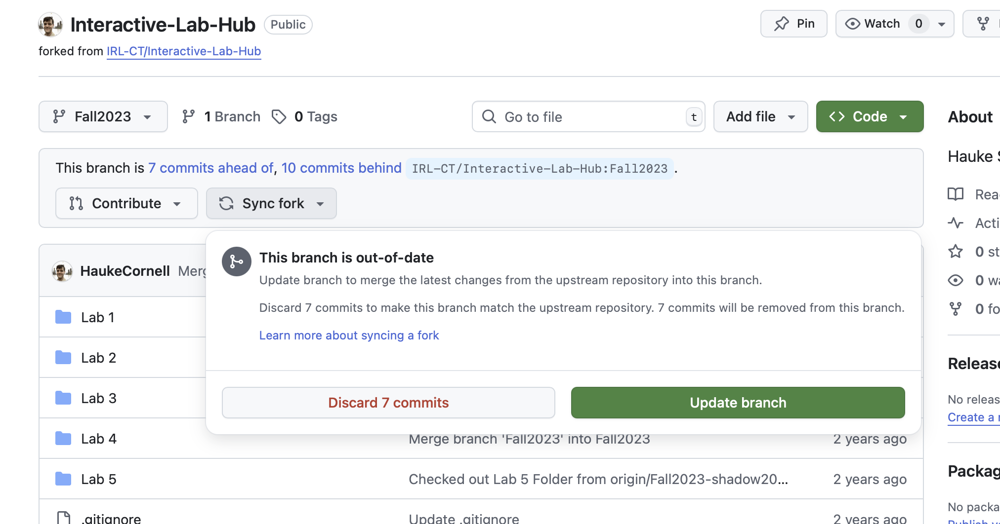
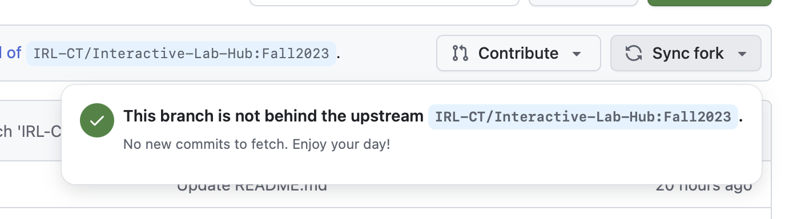

# How to Update Your Lab Hub Fork Safely

This guide explains how to pull updates from the main course repository while protecting your own work from being overwritten.

## Overview

The course repository is updated biweekly with:
- New lab content
- Bug fixes to existing code
- Clarifications to instructions
- Updated requirements or dependencies

You need to pull these updates while preserving your completed lab work.

## Before You Start

**⚠️ ALWAYS commit your work before pulling updates!**

Make sure all your lab work is committed and pushed to your repository:
```bash
git add .
git commit -m "Save my lab work before pulling updates"
git push origin main
```
When in doubt keep a local copy of your files, and copy paste between!


## Method 1: Using GitHub's Sync Fork Button (Recommended)

### Step 1: Check for Updates
1. Go to your forked repository on GitHub
2. Look for a message like "This branch is X commits behind IRL-CT:Fall2025"

### Step 2: Sync Fork
1. Click the **"Sync fork"** button
2. Review what changes will be pulled in
3. Click **"Update branch"**




### Step 3: Handle Conflicts (if any)
If you see merge conflicts:
1. **Don't panic!** This means you've modified files that were also updated upstream
2. Click **"Resolve conflicts"** on GitHub's web interface
3. Or pull the changes locally and resolve conflicts in your editor

## Method 2: Command Line Approach

### Step 1: Add Upstream Remote (One-time setup)
```bash
# Navigate to your repository
cd path/to/your/Interactive-Lab-Hub

# Add the main course repository as upstream
git remote add upstream https://github.com/IRL-CT/Interactive-Lab-Hub.git

# Verify it was added
git remote -v
```

### Step 2: Fetch Updates
```bash
# Fetch the latest changes from upstream
git fetch upstream

# Check what's different
git log HEAD..upstream/Fall2025 --oneline
```

### Step 3: Merge Updates
```bash
# Make sure you're on your main branch
git checkout Fall2025

# Merge upstream changes
git merge upstream/Fall2025
```

## Avoiding Conflicts: Tips

- Edit only in sections marked for your work.
- Avoid changing `requirements.txt`, starter code, or file structure.
- Safe to edit: README.md in lab folders, new files, and marked sections.
- If modifying provided files, back them up first:
    ```bash
    cp original-file.py my-modified-file.py
    ```

## Resolving Merge Conflicts

If you encounter conflicts:

### 1. **Identify Conflicted Files**
```bash
git status
# Look for files marked as "both modified"
```

### 2. **Open Conflicted Files**
Look for conflict markers:
```
<<<<<<< HEAD
Your changes
=======
Upstream changes
>>>>>>> upstream/Fall2025
```

### 3. **Resolve Conflicts**
- Keep your work: Delete the upstream section and conflict markers
- Accept upstream: Delete your section and conflict markers  
- Combine both: Merge the changes manually

### 4. **Commit the Resolution**
```bash
git add resolved-file.py
git commit -m "Resolve merge conflicts in lab updates"
```

## Emergency: "I Messed Up!"

### If you accidentally overwrote your work:

1. **Check git history:**
   ```bash
   git log --oneline
   git show [commit-hash]
   ```

2. **Recover from a previous commit:**
   ```bash
   git checkout [commit-hash] -- path/to/your/file.py
   ```

3. **Use GitHub's web interface:**
   - Go to your repository
   - Click on the file
   - Click "History" 
   - Find your previous version and copy the content

## When to Update

- **Week 2, 4, 6, 8, 10, 12**: Check for updates after class
- **Before starting a new lab**: Always pull latest updates
- **If you're having issues**: Updates might contain bug fixes

## Getting Help

If you run into problems:
1. **Save your work first!** Commit everything
2. Create an issue in your repository with:
   - What you were trying to do
   - The error message you received
   - Screenshots of any conflicts
3. Ask for help in class or office hours

Remember: Updates are meant to help you succeed. When in doubt, save your work and ask for help!
